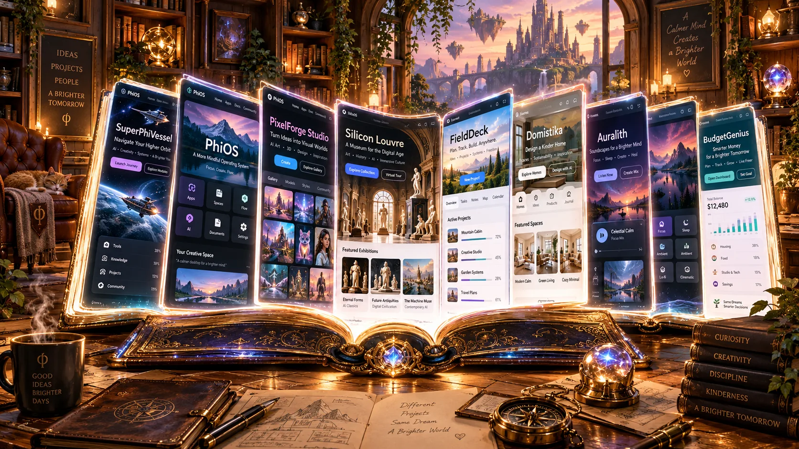

# The Field Atlas ✦

**A cozy, interactive living library of public GitHub Pages projects.**

## v0.3: Enter the wings, open the world

**The immersive study stays lightweight.** Enter the Research, Creative, Engineering, Games, or Curious Annex rooms for an animated arched doorway, atmospheric themed light, a small interactive bookshelf with book-spine shortcuts, and the existing full living reader. Everything still works without a 3D graphics card. This is a *cinematic 2.5D transition*, not yet a walkable Three.js room.

**All verified, public GitHub Pages sites get shared chapters automatically.** On every deploy and once daily through GitHub Actions, `npm run catalog:sync`:

1. Lists **public owner repositories only** via the GitHub REST API.
2. Selects only repos with GitHub Pages enabled, excluding private, archived, and third-party repos.
3. Makes a bounded HTTPS HTTP request to their Pages URLs and checks that the result is an available HTML page. Valid HTTPS custom-domain redirects are allowed.
4. Writes `public/pages-discovered.json` with verification counts and published URL.
5. Builds and deploys that catalog so *all visitors* see confirmed public sites automatically when opening the Atlas.

The original nine curated chapters remain as a fallback. New additions are de-duplicated by repository and URL. Local user additions and hidden chapters stay private to each browser. The manual new-arrivals inbox remains available for Pages-enabled projects that cannot be confirmed automatically.

**Limits:** A valid HTML response does not guarantee iframe permission, full app functionality, or that the site is appropriate for every audience. Some domains and network edges may fail a temporary verification and can be reviewed manually. Re-checks occur during deployment, not continuously. GitHub Pages embedding restrictions still require the `Open this world` link.

```bash
npm run catalog:sync  # optional local public-only discovery
npm test              # includes safe filtering/probing tests
npm run build
```

## v0.2: The Living Library

A new row of themed rooms organizes existing chapters: **Research Wing**, **Creative Wing**, **Engineering Wing**, **Game Room**, and **Curious Annex**, plus the complete library. The book itself stays central, and page-turning still works inside any room.

**New-arrivals inbox (v0.2 manual path):** When an existing browser opens FieldAtlas, the app can check public GitHub repository metadata once every 24 hours. It lists newly discovered Pages-enabled repositories in the Curate dialog for the visitor to inspect, **not** in the actual book. Each arrival has a direct preview link, suggested category, explicit *Add chapter* approval, and a *Dismiss* control. Manual refresh is available, and automatic checks can be disabled. The app requests no GitHub credentials and never mutates repositories.

**What approval means:** browser-specific chapter approvals and dismissals are stored in localStorage. They do not add an unverified site to the shared public book for all visitors. Verified Pages in the generated manifest are shared automatically. To curate a public chapter for everyone, edit `src/catalog.js` and submit a regular GitHub pull request. This distinction is deliberate: public websites should not be globally featured from unreviewed metadata.

**Discovery limitations:** GitHub's `has_pages` flag is not proof a site is reachable, published correctly, or iframe-embeddable. Custom-domain homepages that do not use the owner's github.io host may require manual URL correction. GitHub API rate limits apply.


The React app uses an original AI-generated cozy study illustration as its backdrop, with an interactive illuminated book at its center. Each turn of the page reveals an actual web app in an iframe, along with its story and a direct link.



## What works

- Cozy study scene with warm lamplight and optional evening mode.
- 3D-style page flip animations, left/right arrows, and keyboard navigation.
- Curated starter chapters from MichaelWave369's GitHub Pages projects.
- Live embedded website previews, **plus always-visible direct links**. (Iframe embedding is not guaranteed.)
- Fullscreen reader with direct-link fallback.
- Search, chapter categories, bookmarks, and themed library wings.
- Curate-the-book drawer: add and remove chapters.
- **Discover public GitHub Pages** through the public GitHub REST API with a manual-review inbox; uses public metadata only and never needs a token.
- Browser-local storage for customized chapters and bookmarks. No server or login.
- GitHub Actions workflow for GitHub Pages deployment.
- Mobile-friendly layout and reduced-motion support.

## Run locally

Node.js 20.19+ or Node.js 22+ recommended.

```bash
npm install
npm run dev
```

Open the URL printed by Vite (usually `http://localhost:5173`).

Test and build:

```bash
npm test
npm run build
npm run preview
```

## Deploy to GitHub Pages

1. Create an empty public GitHub repository, e.g. `FieldAtlas` (or `FieldStudy`).
2. Push the contents of this folder to its `main` branch.
3. In repository **Settings → Pages**, choose **GitHub Actions** as the build and deployment source.
4. Push a commit or use **Actions → Deploy The Field Atlas → Run workflow**.
5. GitHub Pages will serve it at `https://michaelwave369.github.io/FieldAtlas/` if the repository is called `FieldAtlas` and no custom domain is configured.

The Vite config uses relative asset paths so no repo-specific base pathname is required.

## Pages and permissions

The canonical publicly visible starter book is in [`src/catalog.js`](src/catalog.js). Nine examples are seeded. Some URLs were taken directly from the GitHub repository's declared homepage; others follow the GitHub Pages convention. The repository's `has_pages` flag does not guarantee that a deployed URL currently returns a functioning website. Edit or remove any inaccurate entry in the browser.

**No private repositories are scanned or exposed.** GitHub's unauthenticated public API is used for discovery, so the `has_pages` results only cover publicly accessible repositories. GitHub imposes unauthenticated API rate limits. Discovery checks the public repository list, not individual websites' iframe permissions.

### Iframe caveat

A target site may prevent framing via Content-Security-Policy `frame-ancestors` or `X-Frame-Options`, or the embedded application may require a larger viewport. The book always keeps an **Open this world** link available. It is not possible for the book to reliably detect or override every framing restriction, and the app doesn't try.

### Local storage caveat

Book customizations live only in the current browser/profile and origin. They are not synced across devices. For a canonical public catalog, update `src/catalog.js` and redeploy.

### Security + licensing

- Treat discovered and user-added URLs as external sites; verify them before featuring them in a public curated catalog.
- Never commit credentials, API keys, private repositories, private issue content, or sensitive personal data into the static site.
- The React application code is provided under MIT; the illustrated backdrop was generated for this project and is included with the app. Embedded destination projects retain their respective licenses.

## Project layout

```text
src/main.jsx     Reader, animated book, curating UI, fullscreen mode
src/style.css    Illustrated study and book visuals
src/catalog.js   Starter chapters, URL validation, GitHub Pages discovery
public/          Optimized room artwork
.github/workflows/deploy.yml  GitHub Pages deploy
```

## Next phases

- Operator-controlled pinning, naming, and manually-reviewed exclusions for the auto-generated verified catalog.
- Optional screenshots when a target refuses iframe embedding.
- Richer 3D camera transitions (Three.js), optional spatial audio, and a walkable VR study.
- Accessible page thumbnails/reading mode for low-bandwidth devices.

## Instant browser preview (no setup)

Double-click `preview.html`. It is a **lightweight standalone companion**, not the React production build. It includes the same book look, page navigation, a live iframe, favorites, filtering, and a fullscreen view; the React version adds the full shelf editor and public Pages discovery.
